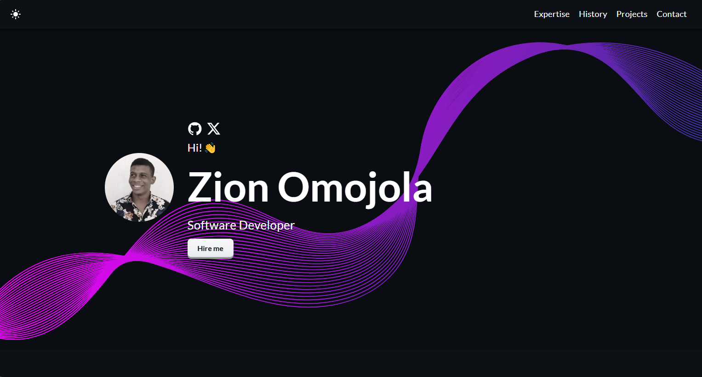

# Omojola Zion's Developer Portfolio

Welcome to my portfolio website! Here, you can explore my skills, career history, and personal projects.

## Tech Stack

## Development Tools

## Career History

### Industrial Training
**TechVerse Academy, Remote**

- Full-stack Web Development
- Project Management
- Business Development

### Undergraduate Computer Science
**Lead City University, Ibadan**

- Frontend Development
- Backend Development
- User Experience
- Team Leading

## Personal Projects

I have worked on various personal projects that demonstrate my expertise in web development and software engineering. Each project has provided me with valuable experience and has contributed to my growth as a developer. Here are a few highlights:

### E-BOOK Library
Developed E-BOOK Library with a vast book collection, engaging animations, and smooth user experience using Open Library API, Swiper, and TailwindCSS.
- **Tech Stack:** Open Library API, Swiper, TailwindCSS, HTML5, CSS3
- **Demo:** [E-BOOK Library](https://zicoly-e-book-website.netlify.app)
- **Source Code:** [GitHub](https://github.com/zicoly/E-BOOK-Library)

### Health Guardian
Designed, developed, and implemented a robust hospital management software with scroll reveal animation for a hackathon project with [The4Coders], streamlining patient care and administrative tasks.
- **Tech Stack:** Node.js, TailwindCSS, Next.js, TypeScript, OpenAI
- **Demo:** [Health Guardian](https://hg-gamma.vercel.app)

### Ecommerce Store
Explore FauxStore: Your playground for simulated online shopping! Experiment with e-commerce features in this repository. Build, test, and have fun!
- **Tech Stack:** React, Redux, CSS
- **Demo:** [Ecommerce Store](https://zicoly.github.io/Lobe-Website)

### TO-DO List Application
Simple To-Do List Application using HTML, CSS, and JavaScript. Features: add todos, mark completion, filter tasks, and remove todos.
- **Tech Stack:** HTML, CSS, JavaScript
- **Demo:** [TO-DO List Application](https://zicoly.github.io/To-do-List-Application/)
- **Source Code:** [GitHub](https://github.com/zicoly/To-do-List-Application)

### Chiquitas-IMS
Collaborated with my team, [The4Coders], to develop an Inventory Management Software for a client's hair business.
- **Tech Stack:** React, Node.js, TailwindCSS, TypeScript, Vite
- **Demo:** [Chiquitas-IMS](https://chiquitas-ims.vercel.app)

### Podia
Recreating the Podia website to enhance web development skills using HTML, CSS, and JavaScript, focusing on designing.
- **Tech Stack:** HTML, CSS, JavaScript
- **Demo:** [Podia](https://zicoly.github.io/Podia/)
- **Source Code:** [GitHub](https://github.com/zicoly/Podia)

### Lobe Website
Recreated the Lobe website using HTML, CSS, and JavaScript to practice web development skills. This project showcases layout, styling, and responsiveness.
- **Tech Stack:** HTML, CSS, JavaScript
- **Demo:** [Lobe Website](https://zicoly.github.io/Lobe-Website)
- **Source Code:** [GitHub](https://github.com/zicoly/Lobe-Website)

### A Simple Guessing Game
Developed an engaging Guessing Game with limited attempts to find the correct number. Enjoy the challenge and test your skills!
- **Tech Stack:** HTML, CSS, JavaScript
- **Demo:** [A Simple Guessing Game](https://zicoly.github.io/The-Guessing-Game/)
- **Source Code:** [GitHub](https://github.com/zicoly/The-Guessing-Game)

## Contact

Feel free to connect with me on [X](https://twitter.com/Zicoly_) or explore my work on [GitHub](https://github.com/zicoly).

## Portfolio Website

Check out my portfolio website, which includes a hero section with a website image, built using 

✅ Responsive design & mobile-friendly  
✅ Supports both dark and light modes  
✅ Built with modern technologies (React, TypeScript, JavaScript, and SCSS)  

[Check it out on Vercel](https://zionportfolio.vercel.app/)
